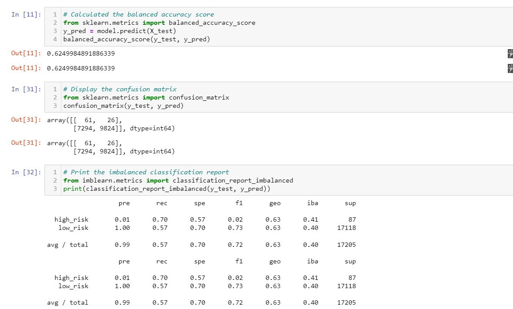
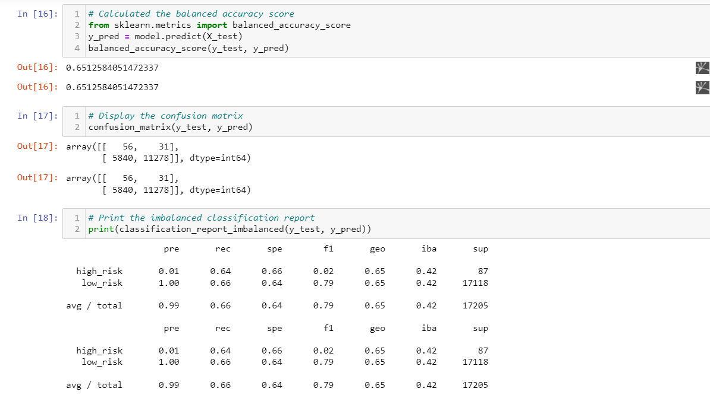
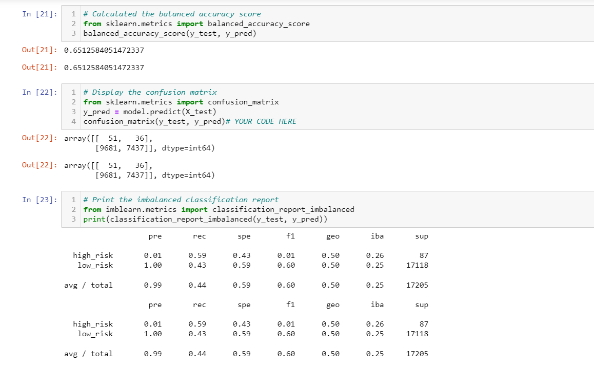
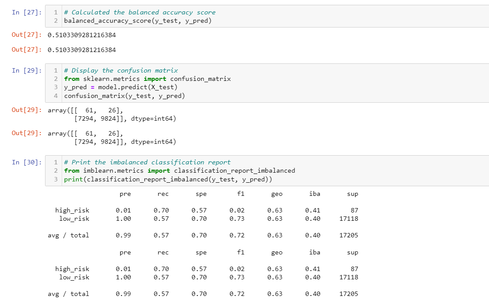
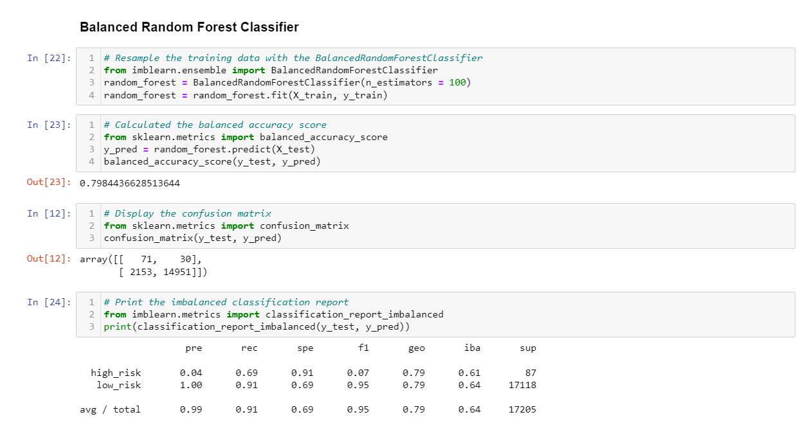
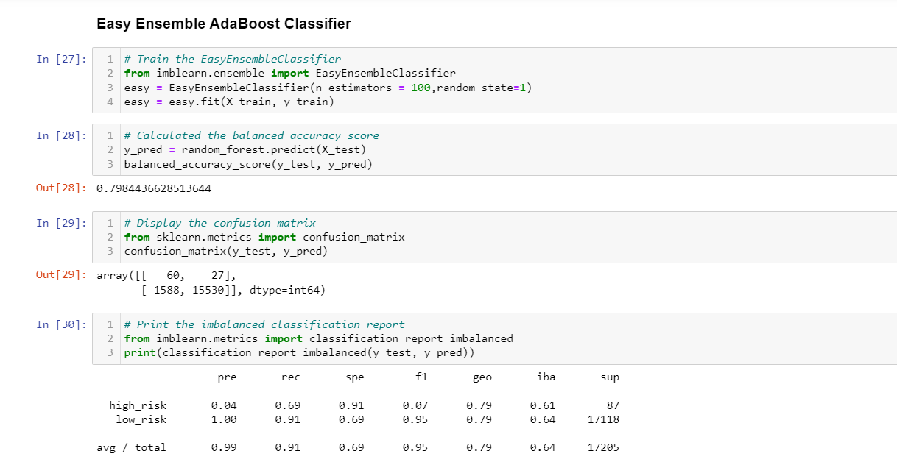

# Credit_Risk_Analysis:

**Overview of the analysis:** Explain the purpose of this analysis.

The purpose of this report is to predict credit risk using data preparation, statistical reasoning, and machine learning.

**Results:** Using bulleted lists, describe the balanced accuracy scores and the precision and recall scores of all six machine learning models. Use screenshots of your outputs to support your results.

The Naive Random Oversampling has 62% accuracy reuslt with high risk of 1% precision and 70% recall. 

The SMOTE Oversampling has 65% accuracy reuslt with high risk of 1% precision and 64% recall.

The Undersampling has 65% accuracy reuslt with high risk of 1% precision and 59% recall.

The combination has 51% accuracy reuslt with high risk of 1% precision and 70% recall.

The Balanced Random Forest Classifier has 80% accuracy reuslt with high risk of 4% precision and 69% recall.

The Easy Ensemble AdaBoost Classifier has 80% accuracy reuslt with high risk of 4% precision and 69% recall.

**Summary:** Summarize the results of the machine learning models, and include a recommendation on the model to use, if any. If you do not recommend any of the models, justify your reasoning.

Comparing all of the models above the two models using wo ensemble algorithms to determine which algorithm results in the best performance shows a better and higher result of acccuracy of 80% as compared to other 4 models. Further the precision and high risk has a great balance rather of just having 1% for precision. 

